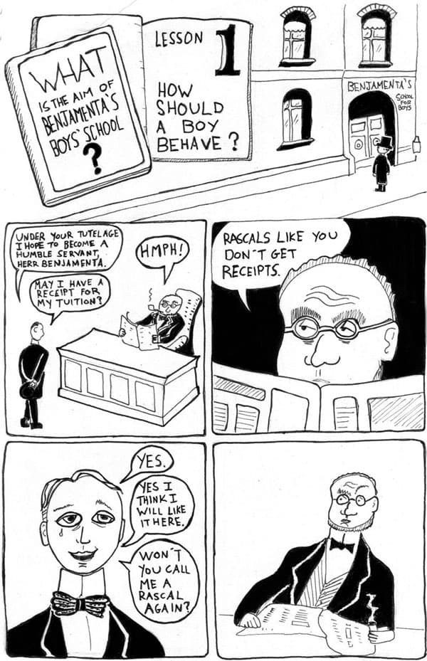
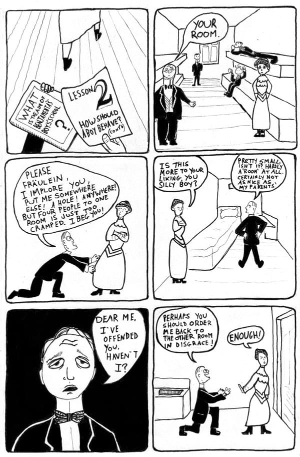
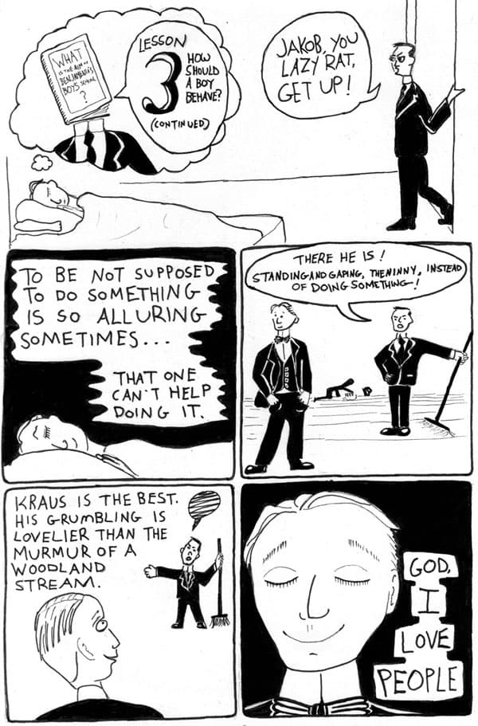
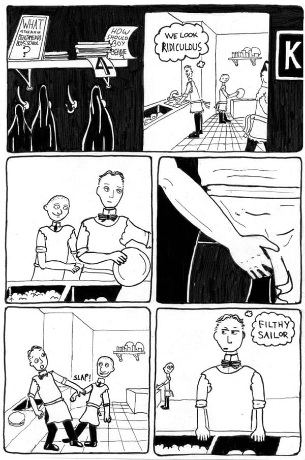
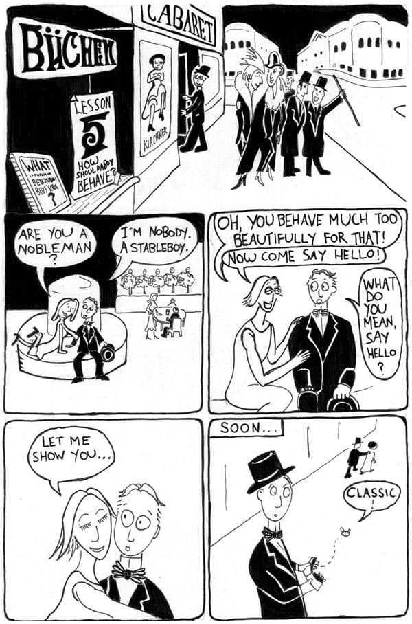
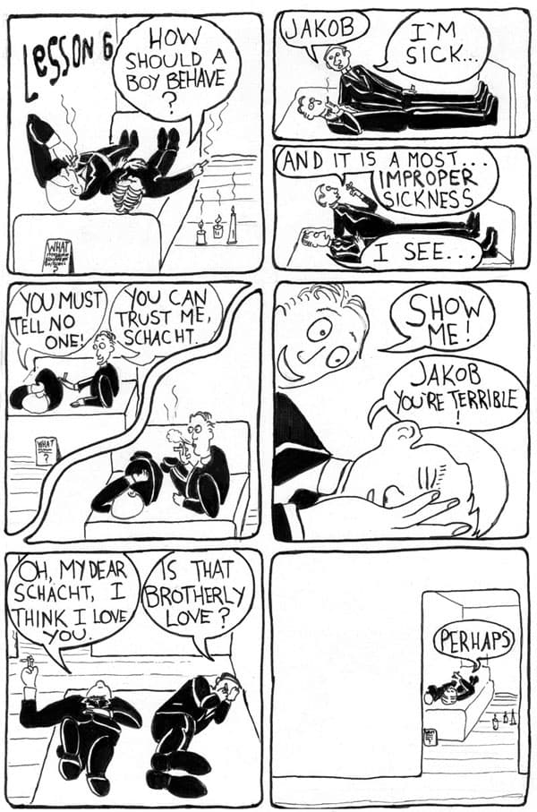
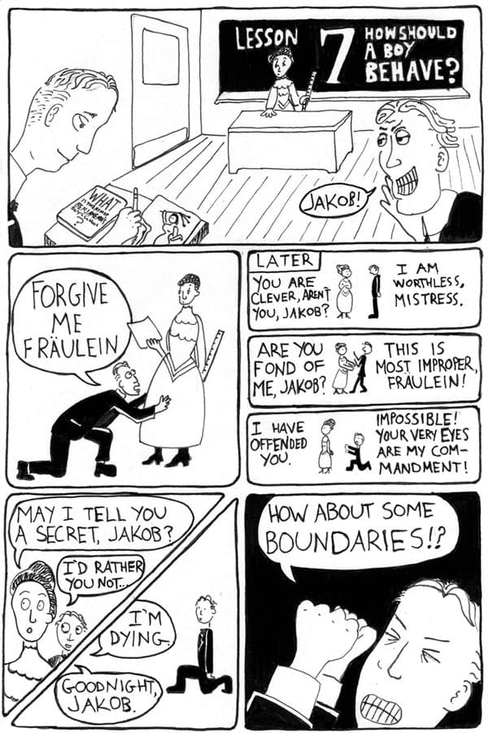
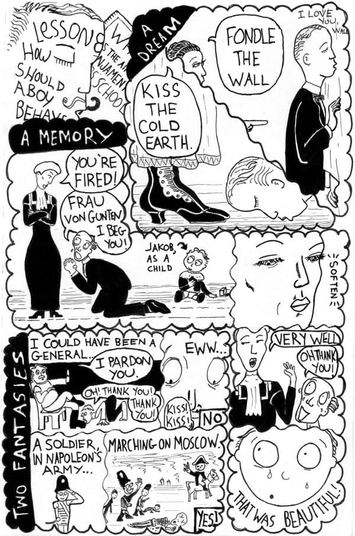
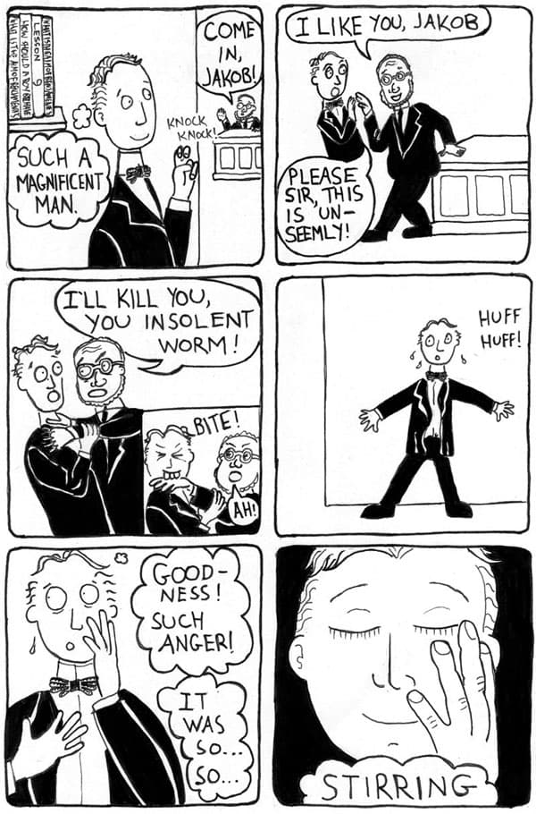

---
# --- Core Fields (Required) ---
title: "How Should a Boy Behave?"
description: "In this ten-part comic series, artist Jonathan Turner adapts Robert Walser’s classic novel about a young nobleman who runs away to join a school for servants. Turner delves into the book’s sly humour and perverse undertones, exploring a sexual dimension of servitude and submission that prominent reviews of the novel often overlook."
author: 'jonathan-turner'
issue: 2
---
I submit to you, dear reader, a series of ten comics based on the 1909 Swiss-German novel, Jakob von Gunten. In this, Robert Walser’s most admired novel, the main character is a young nobleman who has run away from his family to enroll in a school for servants. It seems strange at first, for a young man of his background to aspire to such a low station, but Jakob has an affection for servitude and submission.

Reading this novel today, one detects masochism and homoeroticism that could easily be dismissed as a misreading, anachronistically imposed by our own prurient age. But the pleasure Jakob takes in the play of obedience and resistance is peculiarly intense. Jakob likes to break rules as much as he likes to have them imposed on him, but he is always at pains not to stray too far outside the bounds of Victorian decorum. And perhaps it’s this tension between Jakob’s ardently enjoyed misbehaviour on one hand and his prim admiration of virtue on the other that gives the novel such delicious and sly humour. Reading it for the first time, I found myself giggling like a schoolboy at a dick joke.

Convinced that Jakob was a pervert—and I use the term affectionately—I was surprised that prominent reviews of the novel recognize only his rebellious spirit without delving into its sexual dimension. This comic is my attempt to account for my response, and hopefully share a bit of Walser’s humour in the process.

I submit to you, dear reader, a series of ten comics based on the 1909 Swiss-German novel, Jakob von Gunten. In this, Robert Walser’s most admired novel, the main character is a young nobleman who has run away from his family to enroll in a school for servants. It seems strange at first, for a young man of his background to aspire to such a low station, but Jakob has an affection for servitude and submission.

Reading this novel today, one detects masochism and homoeroticism that could easily be dismissed as a misreading, anachronistically imposed by our own prurient age. But the pleasure Jakob takes in the play of obedience and resistance is peculiarly intense. Jakob likes to break rules as much as he likes to have them imposed on him, but he is always at pains not to stray too far outside the bounds of Victorian decorum. And perhaps it’s this tension between Jakob’s ardently enjoyed misbehaviour on one hand and his prim admiration of virtue on the other that gives the novel such delicious and sly humour. Reading it for the first time, I found myself giggling like a schoolboy at a dick joke.

Convinced that Jakob was a pervert—and I use the term affectionately—I was surprised that prominent reviews of the novel recognize only his rebellious spirit without delving into its sexual dimension. This comic is my attempt to account for my response, and hopefully share a bit of Walser’s humour in the process.

