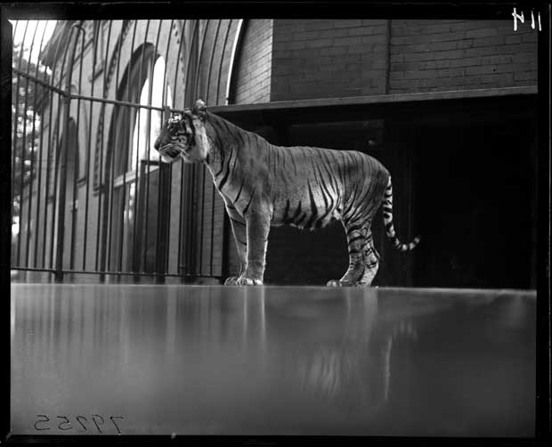

Last summer my friend Walter, the animal trainer, came to my house with his favourite tiger, Loui, and said, I’m going to Mazatlan, just for two weeks, will you please look after my tiger? Walter was wearing a floral-print shirt and a big Tilley Hat. Loui was white and orange. Keep him in your yard, Walter said, and feed him meat and I’ll pick him up as soon as I get back.

When Walter left I went down to the yard and petted Loui on the back. Loui roared, and I built a wire fence to keep him in. In the afternoons Loui paced in circles and figure eights and lay out in the sun and when the trains went by he roared and the rest of the time he slept and ate.

One day the boys from the neighbourhood wandered over. At first they just looked at Loui and laughed, and the sun was shining and from the kitchen window I could see long beams of orange sun on Loui’s white and orange coat and on the boys’ faces. Then one of the boys roared. Loui roared back. Another of the boys picked up a branch and poked at Loui. He'll bite, I yelled out the window. The boy put down the stick and threw a rock into my kitchen and smashed the sugar bowl. Then the boys went away.

In the dark days of fall Loui moved into the basement of the house. I sent his food down in a bucket on a string. I barricaded the door to the upstairs with a bookcase. It was cold and people were hungry and one day a man broke into the basement. Loui roared and the man ran away.

Then snow fell and frost covered the windows and the heating vents to the basement froze over, so Loui climbed the basement stairs and smashed through the door and the barricade and moved into the living room. He liked to lie by the fireplace. He wandered into the kitchen when he was hungry. The house creaked when he walked. When the house was silent I would leave my bedroom to get food.

One quiet night in the spring I took a walk through the neighbourhood. The moon was full and the air was thin. When I came back Loui was standing at my bedroom door. Can I go in? I asked. Loui roared, and in the morning I moved into the backyard.

One day a woman from an animal rights organization came over. We’ve reason to believe you’re keeping a tiger in your yard, she said. I live alone out here, I told her. We’ll be watching you, she said. Have you ever seen a tiger? I asked her. I could see Loui staring down at us from the bedroom window. My dreams are full of tigers, she said, but in these dreams my eyes are closed.

Days went by and Loui and I just stared at each other through the window. Then the boys with the sticks came by and asked about the tiger. He lives upstairs now, I said. The boys threw down their poking sticks and left.

San Diego Zoo, 2009

*“Loui and Me” was adapted by Michal Kozlowski into the children’s book Louis the Tiger Who Came From the Sea, published by Annick Press in 2011. 

