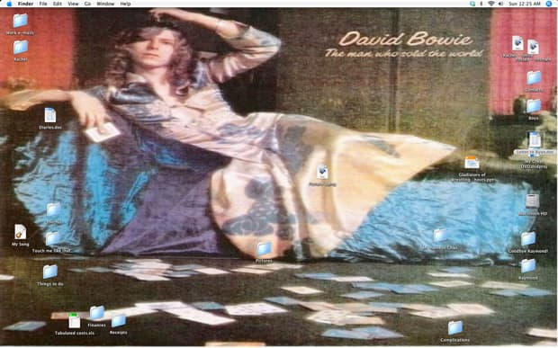

---
title: 'Olympic Trauma Cycle'
description: 'A tale of a mystical journey through arctic waters under a celestial dance.'
author: 'jacob-blanco'
issue: 1
--- 

**February 12, 2010**

## SWM—Olympic Lodging Needed—February 12–26, 2010 (Vancouver)

Phoebe has sublet our apartment. Phoebe is staying with her friend and I’m left to fend for myself. Yes, no phone and no home, and when I stumble down familiar streets I’ll end up . . .  who knows where.

Will you let me stay at your place? I promise I won’t do the following:

-puke (inside, or out a window)
- piss in the shower
- steal
- break things and not replace them
- give empty guarantees to help
- “borrow” clothes
- snoop
- make messes I know I won’t clean up
- walk around in my gonch
- catch anyone masturbating (although it may be funny afterwards)
- treat the hosts like the help
- have sex and not clean it up
- give hosts sick (not the first bullet, but colds, flu, etc.)
- become self-conscious about writing a thank-you note to the point of not writing the thank-you note!

But I *will* write you a thank-you note, I will!

**February 13, 2010**

## Late afternoon—on the bus

It’s just about time to head to my first new friend’s apartment. I’m actually writing this stuff down on paper! I will have to enter it into Phoebe’s computer once she lets me into our apartment. I should have never given her my keys, but she kept up my part of our deal so I had no choice.

I bought some shrimp and walnuts at the supermarket yesterday. I unwrapped the shrimp and threw the Styrofoam into a recycling container, and wrapped the shrimp up in the cellophane. Unfortunately, I forgot them in my coat pocket. The shrimp became mush, and I’m finishing off the walnuts as I write this. I feel very optimistic about what is to come, but I think my coat stinks of shrimp.

## Night

I can’t believe Phoebe got me into this mess—literally!

There are dirty clothes strewn everywhere. I can only presume they’re not clean because I refuse to touch them, and who hangs clean clothes on the floor?

I have to snake my way around piles of objects, and I’ve used the same dishes over again. I think my host believes I’m being polite and expects me to clean other dishes but . . . my mind is on other things. Things are strained. Grrr. I rarely get mad but I raged so much on the phone this afternoon that I felt ripples come from me, as if I were a stone at the instant it breaks the water’s surface. It isn’t his fault; I am demanding, honest and difficult, so I’ve been told . . .

Phoebe! This mess!

~JB

**February 14, 2010**

I left that sty before my host woke up.

Phoebe hung out with me until 9:30 a.m. (when she had to go to work) and returned my key to our apartment. So I crashed on our couch while the subletters were out.

I’m now staying with Raymond and Rachel. They were the second people who answered my post asking for temporary housing. This is not my home. Something is strange.

~

Rachel offered to let me use their computer . . . The desktop photo—I only have moments to write, but I think I should type what I can just in case anything happens to me, document my last hours.

Phoebe, you still have the address? If you don’t hear from me every couple hours, get here quick! It’s so clean in this apartment. The total opposite from last night. Give me a pile of clothes . . . No, it’s okay.

~JB

I cut myself on a pâté knife. Raymond went to the bathroom to get me a Band-Aid and Rachel came back, and now she’s left again to get the Band-Aid.

~JB

The exchanges I’m having with Raymond and Rachel are becoming more interesting. One disappears for a time, and the other comes out. I asked Rachel if Raymond was going to join us for dinner (I thought it polite to accept dinner), but she said he had become ill. The dinner was delicious and I am not ashamed to say I had seconds.

Once finished, Rachel made up a plate and disappeared into the bedroom to feed Raymond before returning to give me a tour of their living room, the spare bedroom, the den, the bathrooms, the atrium, the laundry facilities and the sun decks.

It’s a beautiful view, and I took her “help yourself to the bar” offer at face value.

I’m sitting on the deck, and I’m going to post a copy of the desktop photo, but first I have to move a few things around.

~

I am so lucky!

I was moving icons around on the desktop when Raymond came out! This is the exchange we had:

Ray: I’m feeling better but now Rachel isn’t feeling so great.

Me: That’s too bad.

Ray: I see you’re helping yourself to the vodka.

Me: Sorry, I . . .

Ray: Did she tell you it was okay?

Me: Yes . . . Is it okay?

Ray: Do you like men or women?

Me: I have a girlfriend I love very much.

Ray: What does love have to do with it?

Now he’s disappeared again!

If I make it through the night only needing one Band-Aid, I’m lucky!

~

I have to be more careful.

I am going to need to sleep, and I’ve had too much vodka not to sleep soundly.

Do you think they could have put something in my drink?

Best and only thing to do—*drink my way through it!*

~JB

I’m using *Raychel’s* computer to e-mail myself this entry. Once I realized what was going on, I just kept filling the glasses. I kept moving and bringing up Phoebe and how much we’re in love, and finally I turned around and walked into the guest bedroom without saying a word. I feel bad.

I ruined “their” night, but as I listen to the snoring heap on the couch, I don’t feel so bad about my predicament. It’s difficult when someone doesn’t live the way they would like to, and then they impose it upon a stranger when all he wants to do is sleep, but . . . we worked it out, or at least tried to make an amiable agreement.

Raychel offered to make me breakfast, which I plan to eat.

~JB

## February 15, 2010

I’m free! But I’m hungry again, and I smell.

Breakfast was scrambled eggs and sliced sausages served with Raychel’s homemade blood pudding and a bowl of fruit on the side. I ate and didn’t stick around.

I’m going to see Phoebe.

Maybe we can sneak into our place again, or into where she’s staying, like we used to do when she lived with her parents. Last evening’s buzz will soon wear off and my head is going to throb, and there are so many people around that I can’t find a quiet place to eat my newly purchased shrimp and walnuts.

~JB

## February 15, 2010

*Excerpt from my ex–best friend Howard’s computer journal. I couldn’t resist.*

December 29, 2009

I’ve been seeking the trees.

Michelle and I found out there used to be a plum tree outside our door. The stump below the front porch is a reminder of the fruit of a healthy tree, and its absence. We were told you could walk by and grab armfuls of plums, but the landlord chopped it down.

My grandfather is in hospital. A doctor performed a tracheotomy, which has taken away his ability to speak, and because of his glaucoma, he only has his hearing and his sense of touch left and that’s been dulled by morphine.

I’ve taken it upon myself to read to him, hoping the words make up for the empty promises I gave during the years before this one. I asked Michelle about my regret and she told me that if the years were turned back and I’d done what I’d said then, I’d be a better man and maybe we’d be eating her plum pudding right now, but we’re not and I feel empty.

As I said, I’ve begun to seek out the trees. We love them when they are green and full of life. They are our roots and we owe them our lives, yet we turn our heads to the ground or see right through them when the world turns cold.

I’ve decided to spend time with them, and put my hand upon their withering bark and tell them I’m sorry, tell them what is happening will pass and reassure them that they will be green again this spring, so that in the future we can fill our arms with the fidelity of trees

*If you read this, Howard, I’m sorry. It was too beautiful to keep to yourself.*

## February 23, 2010

*My good friend caught me searching her computer for something to post. I know, terrible. I should have waited until she left me alone. So I had to make her a deal: she won’t throw me out of her apartment until after Phoebe’s temporary residents leave on Saturday if I let her write something and I guarantee to post it. Also, she doesn’t want me to edit it. So it’s all her.*

First, some facts that we women have to overcome every day: we menstruate because we ate an apple, it is our fault that men force themselves on us, and our work is less valuable than men’s work.

I was in the car with my mom years ago when this other car with three guys in it pulled up next to us and asked her to pull over and made jokes about her and me. Now that I’m older I see the ridiculousness in her showing her wedding ring and screaming, “I’m married!” and I understand the patheticness of those guys. They eventually sped off. My mom was shaking. I asked her what they wanted and she told me, “They’re assholes. Stay away from ignorant men.”

I still remember that advice, but I’ve learned that even intelligent men can be assholes and think with their biology first. Granted a lot of men don’t act on their biology, sometimes to our enormous irritation and frustration, but it’s still there. Yes, women talk and think about sex as much as boys, and we enjoy it more, if we’re allowed to (some of you ladies know what I mean).

Here’s some truth: everyone is different—everyone! But some men treat all women the same.

Jacob keeps reading over this and telling me to make a point, but there is no point—this all is the point! Stop seeing us as girls or women and start seeing us as individual selves. We do it for you. We get over your shortcomings. My last two boyfriends were shorter than me and the guy I’m with now is a bit of a loser, but we laugh about it and he doesn’t make me feel that there is something wrong with me even though we both agree there are obviously things wrong with him.

There are some bitches that use really nice guys and the guys can’t see what the girls are doing, like he can’t see that she is so low. Everyone is blinded by biology, which means he’s using her just as much as she’s using him, until they fall in love and live happily every after, God willing.

I hope everyone finds love, even Jacob, because Phoebe treats you like shit!

All right, Jacob, that’s all you get from me. We women need to tell our secrets just like men need to keep them to themselves.

*~ Anonymous*

## February 27, 2010

*Today, a promise between Phoebe and me: no subletting our space unless both of us stay in the same place.*

I promised Phoebe I’d forget that damn straw devil and its infernal maker. She says I have too much time on my hands, “Idle—the devil,” and such superstitious nonsense. I caught someone filming me while I was staking out our building. I felt my privacy evaporate, and that my behaviour was open to enormous amounts of misinterpretation (some can’t see the truth through the mediums). I have begun to seek out the trees, instead of demons and devils, like the mighty tiger and my cousin Dean.

“Keep your head down, and stay out of the trees,” my grandfather told Dean the year he got his first set of golf clubs and my sister bought a print of a snow tiger in a tree. That same year I was uprooted by my first girlfriend and began to nurture my strong dislike for patchouli, patchouly and even pachouli.

As I said, I’ve been spending time with trees, and when I do, I feel what we all know—their fidelity. We forget we don’t know trees. We don’t name them, we don’t talk with them, we don’t touch them or listen to them . . . They are not of our kind, yet they give us more than we give them. We admire them until they offend us and then we cut them down for being true to their nature—growing in their own directions. You give them attention, and they grow with you. You don’t, and they still grow but you don’t see it. Yes, Howard’s grandfather was in hospital. He thought his grandfather was withering into a trunk of the man he loved, but, like the trees themselves, Howard’s grandfather has recovered and is showing us life. As a child I loved going for walks in Central Park with my sister and grandparents and their dog, Lucky. I remember the canopies of the trees being imposing, but I would always return to one willow whenever we went for a walk. Phoebe and I were there this past weekend and I took her to where my favourite tree used to be. We sat on the ground and I told her about our family walks in the park. She told me that, given enough time, the branches of the willow would have touched the ground, making a curtain, hiding us away from the world, and that it was okay to cry over the stump that is all that is left of it.

This spring the world seems colder, distant, and yet we still welcome it, as if our kinship were excited and we were tightly fastened to the truth—trees, and their lives, do matter; and only touch can translate our feelings to weeping willows, plum trees and people.

Today Dean will be among the trees while trying to stay clear of them, my sister will love the life in every one, and Phoebe and I will watch them grow, talk with them and learn their names. Straw devils be damned because today I hope to gain more understanding of the fidelity of trees.

~JB
